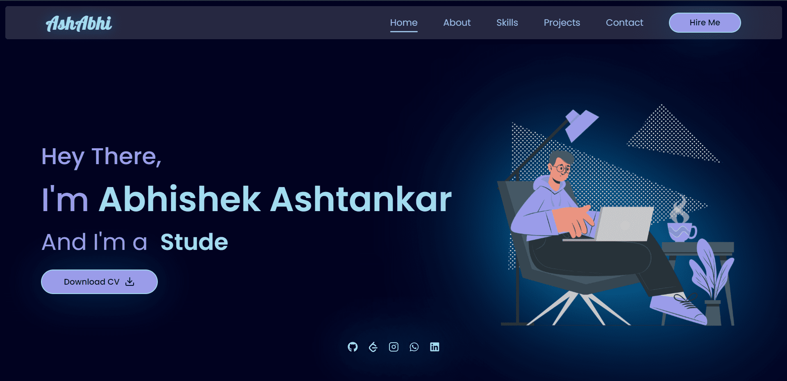

# Abhishek Ashtankar - Portfolio Website

[](https://abhishekashtankar.com/)
[](LICENSE.md)

## About

Welcome to my portfolio website! This website showcases my work, skills, and experiences as Abhishek Ashtankar.

## Getting Started

To run this website locally on your machine, follow these steps:

### Prerequisites

Make sure you have the following prerequisites installed:

- Node.js: [Download Node.js](https://nodejs.org/)
- npm (Node Package Manager): [npm Documentation](https://docs.npmjs.com/getting-started/installing-node)

### Installation

1. Clone the repository:

   ```bash
   git clone https://github.com/yourusername/your-portfolio-website.git

2. Navigate to the project directory:

    ```bash
    cd your-portfolio-website

3. Install dependencies:

    ```bash
    npm install

### Features

This portfolio website includes the following features:

Showcase of my projects and accomplishments.
Insights into my skills, qualifications, and experiences.
A blog section where I share industry insights and experiences.

### Screenshots

Here are some screenshots of my portfolio website:

##### Homepage



##### About Page


##### Skill Page


##### Project Page


### Contributing

Contributions are welcome! If you have suggestions or find issues, please open an issue or follow these steps to contribute:

1. Fork the project.
2. Create your feature branch (git checkout -b feature/YourFeature).
3. Commit your changes (git commit -m 'Add some feature').
4. Push to the branch (git push origin feature/YourFeature).
5. Open a pull request.

### Usage

To run the website locally, use the following command:

    ```bash
    'npm start'

